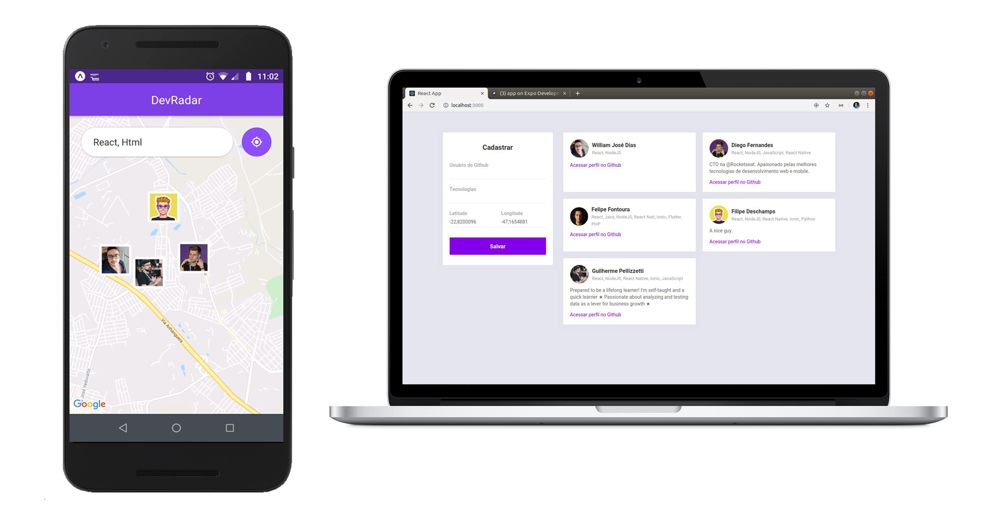

<h1 align="center">Dev Radar</h1>

<h4 align="center">Semana Omnistack 10</h4>

    

## O Projeto
O SearchDev foi um projeto desenvolvido durante a semana Omnistack da RocketSeat, que tem o propósito de exibir desenvolvedores próximos de você e que trabalham com as mesmas tecnologias 

## Tecnologias
Projeto desenvolvido com as seguintes tecnologias:
- Node.JS
- React
- React Native
- Expo

## Instalação e execução do backend
1. Faça o download do projeto
2. Na pasta backend rode o comando `yarn` para instalar todas as dependências necessárias
3. Crie um arquivo `.env` seguindo a base do `.env.example`
4. Rode o comando `yarn dev` para subir o servidor

## Instalação e execução do frontend web
1. Na pasta web rode o comando `yarn` para instalar as dependências necessárias
2. Rode o comando `yarn start` para iniciar sua aplicação web

## Instalação e execução do app mobile
1. Na pasta app rode o comando `yarn` para instalar as dependências necessárias
2. Rode o comando `npm install expo-cli --global` para instalar o expo-cli
3. Rode o comando `expo start` para iniciar o expo
4. Com o expo já instalar no seu smartphone, escanei o QRCode do expo para executar a aplicação mobile

---

Desenvolvido por [William José Dias!](https://github.com/WilliamWJD)